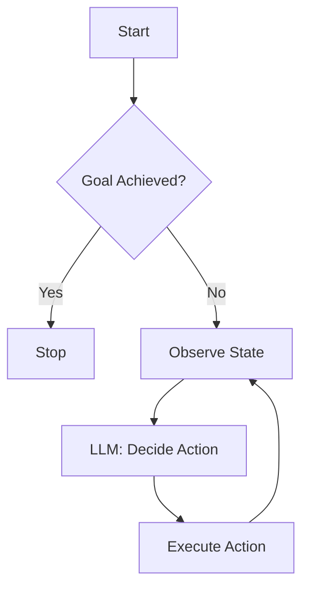

# Phase 1: Foundations – From LLMs to Agents

## What Creates "Agency"?

In software engineering terms, a standard LLM call is a **Pure Function** (roughly):
`Output = LLM(Prompt)`

An **Agent** is a **Stateful Control Loop**:
`while not Done: State' = F(State, Observation)`

The transition from "Passive Generator" to "Active Agent" happens when you wrap the LLM in a loop that allows it to:
1.  **Observe** the environment (or conversation history).
2.  **Reason** about what to do next (Plan/Decide).
3.  **Act** (Output a command, tool call, or final answer).
4.  **Loop** back to step 1 with the result of the action.

## The Core Loop (ReAct Pattern Simplified)

The most common architecture is the **Observation-Thought-Action** loop.

## Pipelines vs. Agents

*   **Pipeline / Workflow**: Hardcoded sequence of steps.
    *   `Step 1 -> Step 2 -> Step 3`
    *   Reliable, predictable, brittle to edge cases.
*   **Agent**: Dynamic sequence of steps determined at runtime.
    *   `Goal: "Fix the server"` -> *Agent figures out it needs to check logs, then restart nginx.*
    *   Flexible, autonomous, non-deterministic (requires guardrails).

## Engineering Trade-offs

| Feature | Pipeline | Agent |
| :--- | :--- | :--- |
| **Control Flow** | Defined at compile/design time | Decided at runtime by LLM |
| **Error Handling** | `try/catch` blocks | "Self-healing" (retry with new context) |
| **Complexity** | Low | High (Infinite loops, hallucinations) |
| ** predictability** | High | Low |

In this phase, we build a **Single-Loop Agent**. We will simulate the LLM to understand the architecture without the noise of non-deterministic API calls.
